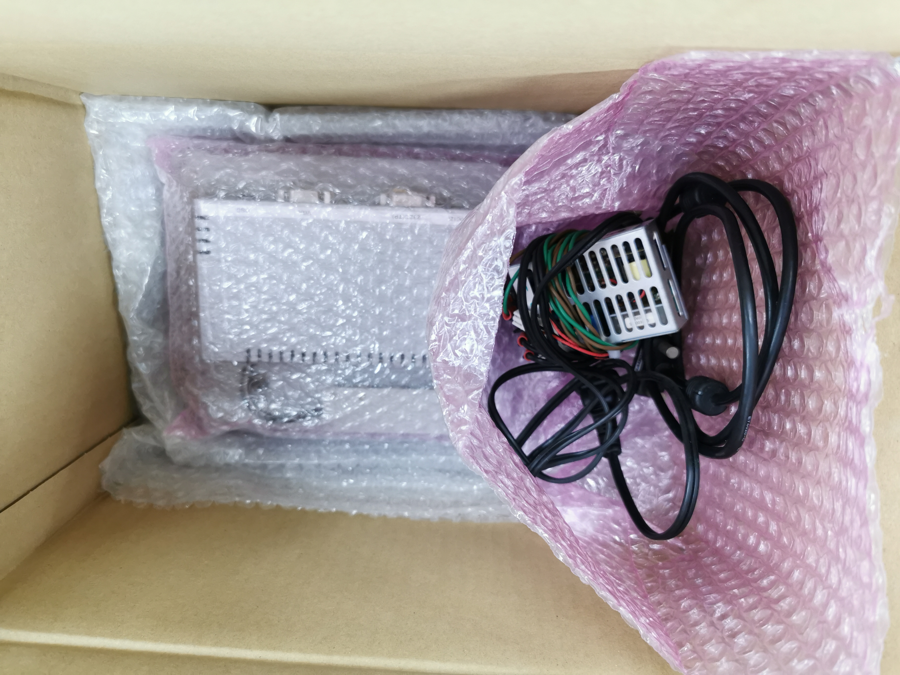

# 事務関係マニュアル
## 休日出勤について
前日の昼までに上長と相談の上、社長に個別に申請します。

**休日出勤時のタイムカードの打刻漏れ**には特に注意してください。
最悪、認められないケースも発生するので、慎重に対応をお願いします！

## 経費の精算について
1. 資料代
2. 通信費
3. 消耗品費

|概要 |内容
|--|--
|資料代|資料本 資料アプリ|
|通信費|切手 宅急便料金|
|消耗品費|文具 台所用品|

## 宅配便の発送について
## 電話、来客対応について
## ごみ収集について
## プリンタについて
## 大容量データの送受信について